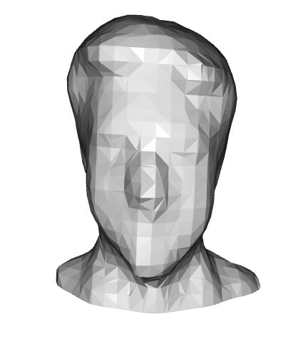

# HeadScanning

This script is a complete Python pipeline for creating 3D models using an Intel RealSense D435 mounted on a Universal Robots UR5e. The script captures
point cloud data, transforms captured data into a common coordinate frame, statistically denoises the merged point cloud using MCMD_Z, fills the base
of the cleaned, merged cloud, and performs Poisson Surface Reconstruction to output a watertight STL model with a flat base. This pipeline was developed as part of a Master's thesis in Applied Mathematics and Statistics at Cal Poly Pomona.

**Example output:**


---

## Project Structure

```
HeadScanning/
├── head_scanner.py     # Main pipeline (capture → mesh)
├── requirements.txt    # Python dependencies
└── README.md
```

---

## Setup Guide

This guide assumes no prior experience. Follow each step carefully.

### Step 1 — Hardware setup

Before running anything, make sure you have:

- A **Universal Robots UR5e** powered on, in Remote Control mode, connected to the local network
- An **Intel RealSense Depth Camera D435** mounted directly to the robot's tool flange using the project mounting bracket
- The camera connected to your computer via USB-C
- A flat surface in front of the robot where the scanned object will be placed

> The pipeline depends on the camera being in the exact mounting position used during calibration. If the bracket has been moved or replaced, you'll need to recalibrate the camera TCP — see Step 5.

### Step 2 — Install Python

You need **Python 3.10 or newer**.

- **Check if you already have it:**

  ```
  python3 --version
  ```

  If this prints `Python 3.10.x` or higher, skip to Step 3.

- **Install Python (if needed):**

  * Go to <https://www.python.org/downloads/>
  * Download the latest stable release and run the installer
  * On the Windows installer, check **"Add Python to PATH"** before clicking Install

### Step 3 — Get the Code

Open a terminal (Mac/Linux) or Command Prompt (Windows) and run:

```
git clone https://github.com/blainebehen/HeadScanning.git
cd HeadScanning
```

> Don't have `git`? Download it from <https://git-scm.com/downloads>, or download the project as a ZIP from GitHub and unzip it.

### Step 4 — Install Dependencies

```
pip install -r requirements.txt
```

> *Optional:* if you want a GUI to verify the camera is working before running the pipeline, install Intel **RealSense Viewer** from <https://www.intelrealsense.com/sdk-2/>. Make sure to close RealSense Viewer before running `head_scanner.py` — only one program can access the camera at a time.

### Step 5 — Configure the Script

Open `head_scanner.py` in a text editor and edit the `USER SETTINGS` block near the top:

- `ROBOT_IP` — the IP address of the UR5e on the local network
- `OUT_DIR` — the directory where output files will be saved

The other settings (motion speed, bounding box, MCMD parameters, Poisson parameters) have working defaults.

> If the camera mounting bracket has changed, you also need to update `p_cam` and `d_cam` in the `TRANSFORM DEFINITIONS` block. See Section 2.4 of the thesis for the calibration procedure.

---

## Running the Pipeline

With the robot powered on, in Remote Control mode, and the camera connected:

```
python head_scanner.py
```

The script will prompt you for an object name, then automatically:

1. Drive the robot through the seven capture poses
2. Save RGBD frames and per-pose point clouds
3. Merge the point clouds into the robot's base frame
4. Denoise with MCMD_Z
5. Fill the underside of the object with synthetic base points
6. Mesh the result with Poisson Surface Reconstruction
7. Slice the bottom flat and export the final STL

When it finishes, you'll have these files in your `OUT_DIR` (filenames use the sanitized object name — `mug` shown here as an example):

| File | Description |
| ---- | ----------- |
| `merged_pointcloud_mug.ply` | Raw merged point cloud, all seven captures combined |
| `MCMD_cleaned_pointcloud_mug.ply` | After MCMD_Z denoising |
| `MCMD_cleaned_pointcloud_filled_mug.ply` | Denoised cloud with synthetic base added |
| `poisson_mesh_mug.stl` | Watertight mesh from Poisson reconstruction |
| `flat_base_mug.stl` | Final mesh with flat base — **this is the one you print** |

Per-pose captures (`color_0.png`, `depth_0.png`, `cloud_pos_0.ply`, etc.) are also saved for debugging.

---

## Coverage Region

The seven-pose protocol is calibrated for objects placed on a flat surface in front of the robot at approximately `(-41, -400, -17)` mm relative to the robot base.

For best results, the object should fit within these bounds:

- `x ∈ [-173, 95]` mm
- `y ∈ [-550, -264]` mm
- `z ∈ [-17, 220]` mm

Objects outside this region may not be fully captured by the seven-pose sweep.

---

## Tips

- **Matte, opaque objects scan best.** Clear plastics and shiny metals can cause sparse point cloud sampling or extraneous points/meshing.
- **Fine details smaller than ~7 mm get smoothed.** by Poisson reconstruction at the default octree depth. Increase `POISSON_DEPTH` to preserve them, at the cost of more noise.
- **Don't move the table or robot base between scans.** The scanning protocol is designed for a fixed setup.
- **For specular (shiny) objects:** oblique camera angles capture better than direct ones — see Section 3.2 of the thesis.

---

## Citation

If you use this code in academic work, please cite the thesis:

> Behen, B. (2026). *Building a 3D Scanner*. Master's thesis, California State Polytechnic University, Pomona.

## Acknowledgments

Developed under the supervision of Dr. Arlo Caine in the Department of Mathematics and Statistics at Cal Poly Pomona.
